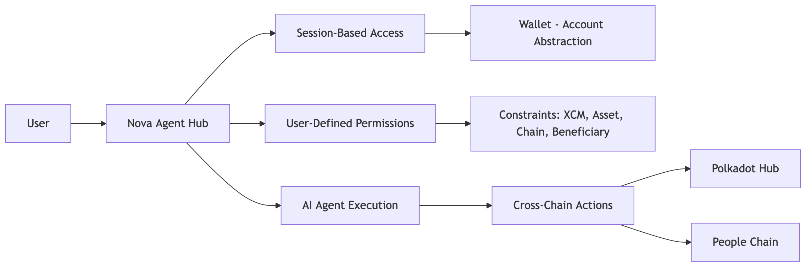

# Nova - Agent Hub in Polkadot Hub

## Live App
https://polkadot-solidity-hackathon.vercel.app

## Demo
TBD

## Vision
Nova is an Agent Hub on Polkadot Hub for managing cross-chain actions with account abstraction and AI Agent sessions.

## What It Does

Nova lets a user create a session key for an account abstraction wallet, approve that session, and let an AI Agent operate within the granted scope. The user can define what the agent is allowed to do, including the XCM operation type, asset, target chain, and beneficiary. This keeps the wallet flexible for automation while staying under user-defined limits.

## How It Is Made
Nova is built on account abstraction with ERC4337 and IERC7579-style session and module handling. It uses a cross-chain dispatch module and XCM-based execution to route permitted actions across Polkadot Hub and People Chain. The app combines wallet deployment, session approval, validator checks, and live execution into one delegated flow.
